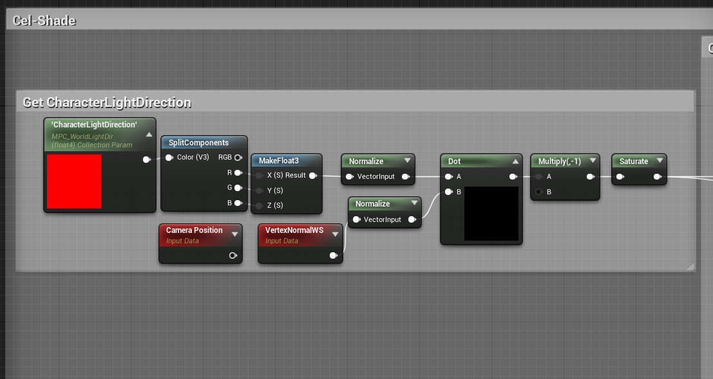

# Unreal Engine NPR Cel Shader
 
 A non-photorealistic rendering (NPR) shader in Unreal Engine 4.

## About

I have created a simple, customizable material shader that mimics the look of Genshin Impact's cel shader.  Currently, the shader features custom lighting based on a main character light and reflective hair shine that changes based on the camera's location.  Additionally, the user can choose to use a toon ramp texture instead of using custom variables.  Futher in development, I plan to add a matcap to any metallic material, using a channel mask to limit the amount of duplicate parent materials, and a post-processing material to add character outlines.

Genshin Impact models are not included in the project, and are used for educational purposes.

## Blueprint - Custom Lighting

Custom Lighting is achieved by first getting the location of the player light in the world.  In Genshin, charatcers are only lit by one main point light and are not effected by any lights in the world.  We then get the dot product between the light position and the vector normal of the material, inverse it then saturate.

Adding the shadow bands is easy.  When the pixel is in light, we show the characters texture of the model.  When below a changeable threshold, the texture colour is multiplied with the set band colour.  When below the second threshold, the texture colour is multiplied with the shadow colour.

## Blueprint - Hair Shine

Hair shine is achieved by taking in the camera's location, normalizing it and getting the dot product between it and the vertex normal again.  We then saturate, inverse and power it to an input param.  To increase the intensity, we t multiply it by another input param and re-inverse it.

We then get the mask for the hair shine from a different texture.  To darken, we multiply it by 0.15 and multiply it again with the previous value.  Finally, we added it to the custom lighting shader.

## Features

- Change the colour and threshold of shadow and allows for a small 'secondary shadow' band that can be customized too
- Seperate material instances for different parts of the model
- Hair shine that is effected by the camera, through fresnel and masking
- Toon ramps instead of custom ramps, taking in a texture to change shadow colour

## Future

- Matcap for metallic parts of the camera
- Post-processing outlines that change colour based on part of model
- 

## Programs Used:
- Unreal Engine 4.26 - Game Engine.
- Blender - Porting Models over
- GitHub Desktop - Git Control. 
